# NiceStartSL

NiceStartSL es mi app para 'Desarrollo de Interfaces' que muestra algunas de las funciones de Android que he aprendido este curso

## Features

- Menú Contextual

- Menú AppBar

- Menú BottomBar (o BottomNavigation)
- SwipeRefreshLayout con SnackBar
- Alert/Modal Dialog
- Expandable Cardview
- app-release.apk o .aab

## Screenshots
| Splash | Login | MainActivity| AppBar Menu | BottomNavMenu| ExpandableCardView|
|:-:|:-:|:-:|:-:|-|-|
| 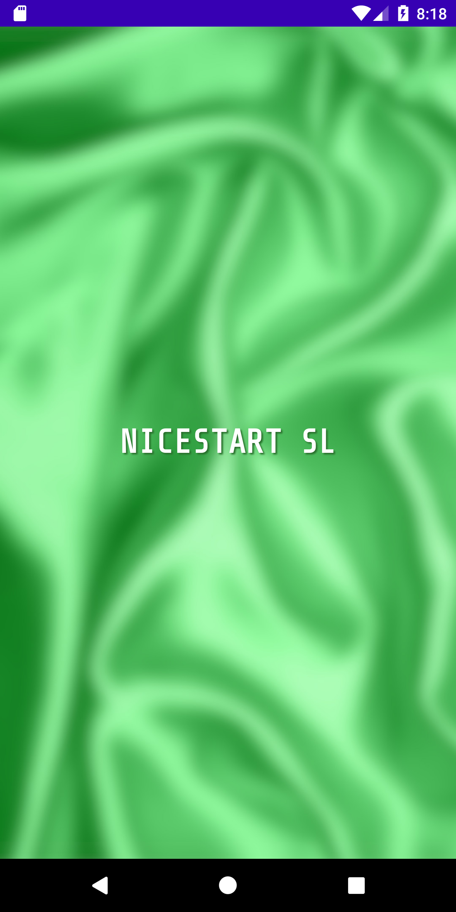 | 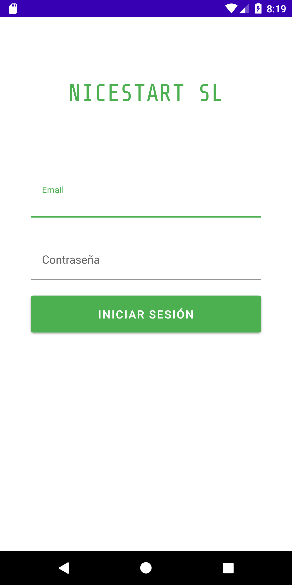 | 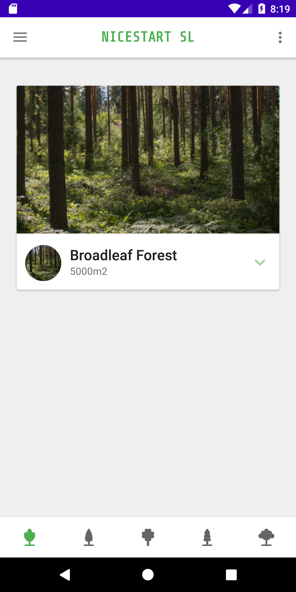 | 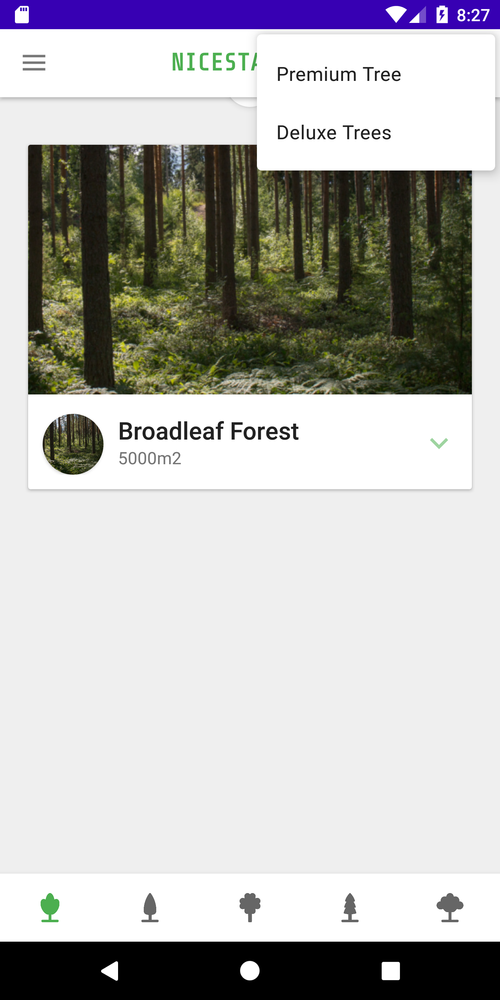 | 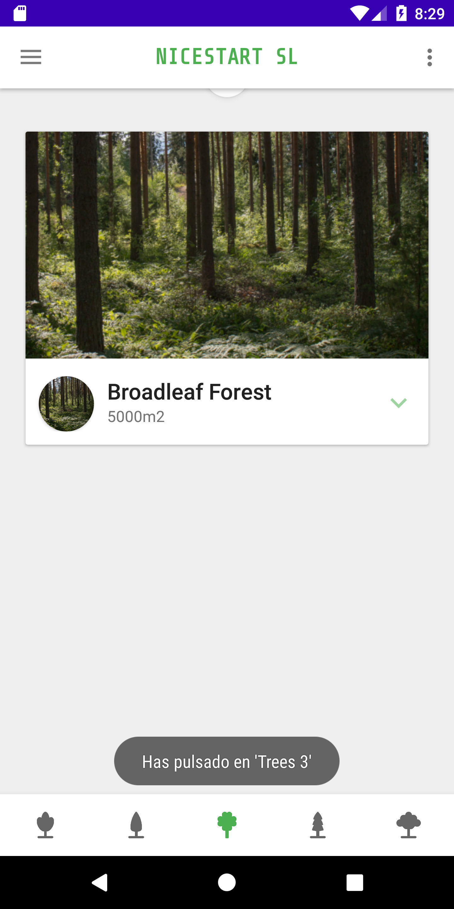 | 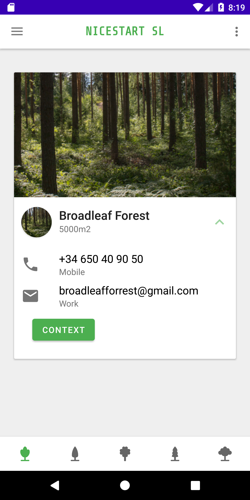 |

| ContextMenu | Nav Drawer | Modal / Alert| SwipeRefreshLayout | Snackbar| Testing|
|:-:|:-:|:-:|:-:|-|-|
| 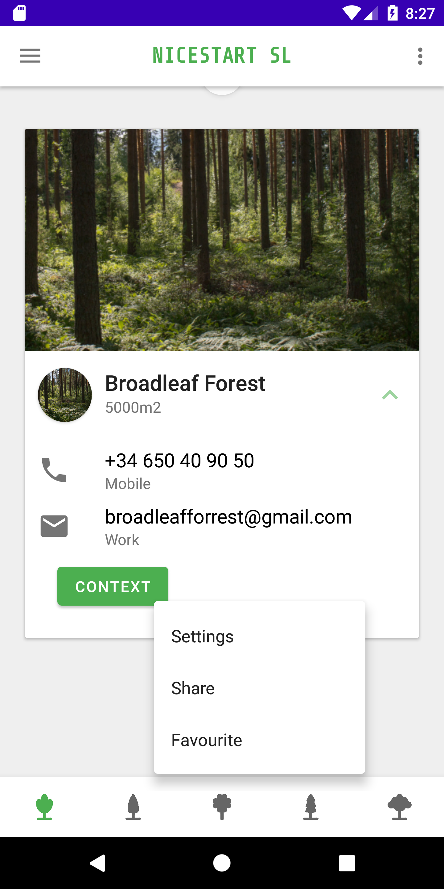 | 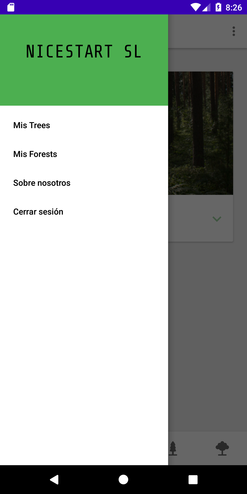 | 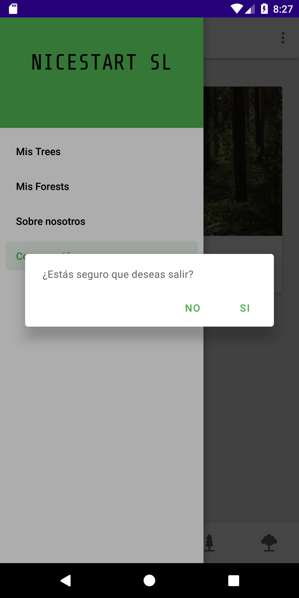 | 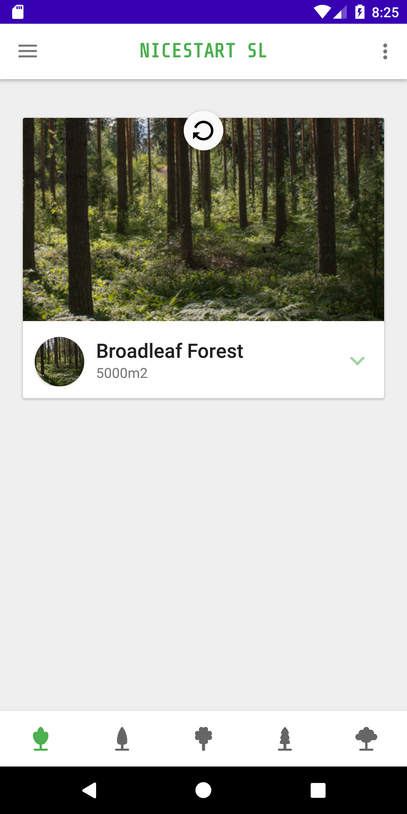 | 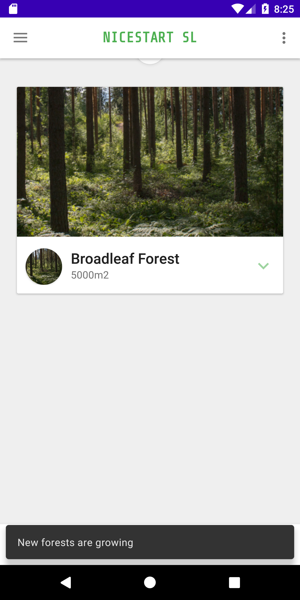 | 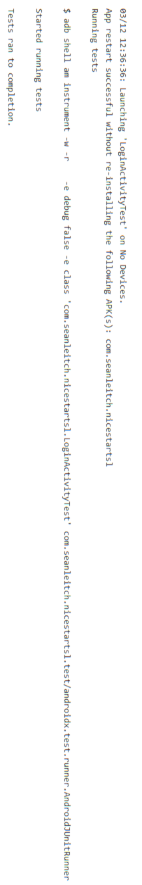 |
